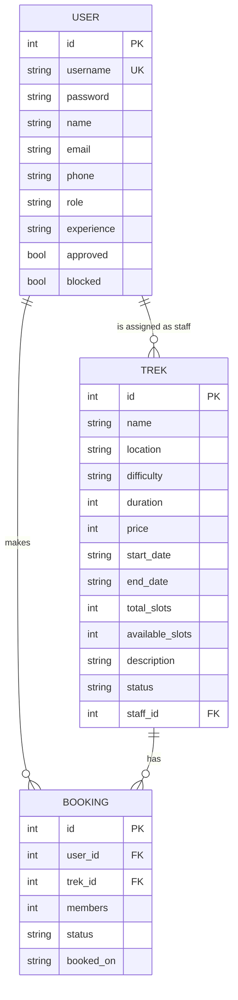

# Trekking Management Application

A web based trekking management system where an admin manages treks, trek guides manage the treks assigned to them, and trekkers search and book available slots. Built with Flask, Jinja2, Bootstrap and SQLite.


---

## What it does

The application solves one main problem: keeping the slot count of a trek correct so that it never gets more bookings than seats available, while making sure each of the three roles can only do the work that belongs to that role.

| Role | Can do |
|---|---|
| **Admin** | Create, edit and delete treks. Approve or reject guide requests. Assign guides to treks. Search treks, guides and users by name or ID. View every booking. Block users and guides. |
| **Trek Staff** | Register on their own, wait for admin approval, then manage only the treks assigned to them, update slots and status, and view the participant list with the number registered per trek. |
| **Trekker** | Register, search and filter treks by name, location and difficulty, book slots, cancel a booking, edit their profile, and see their full booking history. |

### Trek status

A trek moves through `Pending`, `Approved`, `Open`, `Closed` and `Completed`. New treks start as `Pending` and stay hidden from trekkers until the admin approves them. Only a trek that is `Open` can be booked, and only the assigned guide can move it to `Closed` or `Completed`.

---

## Features

**Overbooking is not possible.** A booking is rejected if the requested members exceed the available slots, and the slot count is reduced in the same transaction as the booking row is created.

**Slots can never go below what is booked.** When the admin or a guide changes the total slots, the number of already booked seats is calculated first and any smaller value is refused.

**Guides need approval.** A guide account is created inactive and cannot log in until the admin approves it. Only approved and unblocked guides appear in the assignment dropdown.

**Booking history is preserved.** Cancelling never deletes a row, it changes the status to `Cancelled` and returns the seats. When a guide marks a trek `Completed`, all its active bookings become `Completed` too.

**Blacklisting.** A blocked user or guide cannot log in, and a blocked user cannot book.

**Server side search.** Trek name and location are searched with a LIKE query and filtered by difficulty, all in Flask with no JavaScript.

---

## Tech stack

| Layer | Used |
|---|---|
| Web framework | Flask 3.0.3 |
| Templating | Jinja2 |
| ORM | SQLAlchemy via Flask-SQLAlchemy |
| Database | SQLite, created programmatically |
| Frontend | HTML, Bootstrap 5, small custom CSS |
| Auth | Flask session with Werkzeug password hashing |

No JavaScript is used anywhere in the application.

---

## How the frontend and backend talk

There is no API in this project. No JSON, no fetch, no AJAX. The frontend is not a separate application, it is HTML that Flask builds on the server and sends to the browser already finished, so every interaction is a full page load.


**The cycle.** The browser sends an HTTP request such as `GET /trek/1` or `POST /book/1`. Flask matches the URL against a `@app.route` and calls that function. The function reads `session['role']` and redirects to the login page if the role does not match. It then queries SQLite through SQLAlchemy, gets back Python objects, and passes them to `render_template()`. Jinja2 fills the `{{ }}` and `` placeholders and produces an HTML string, which travels back over HTTP for the browser to paint.

**Sending data to the server.** The only way data reaches the backend is through an HTML form. A form with `method="post"` sends its fields in the request body and the route reads them with `request.form['members']`. The search form on the home page uses `method="get"` instead, so the values arrive in the URL as `?q=Manali&difficulty=Easy` and the route reads them with `request.args.get('q')`. Those two are the entire input surface of the application.

**Remembering who is logged in.** At login the route writes `session['user_id']` and `session['role']` into a cookie signed with `SECRET_KEY`. The browser sends that cookie back on every request. A user can read the cookie but cannot forge it without the key, which is what makes the role checks trustworthy.

**Post, Redirect, Get.** Every route that changes something answers with `redirect()` instead of rendering a page. This is why refreshing the browser after a booking does not book the trek a second time. Messages are passed across the redirect with `flash()`, which stores them in the session until `base.html` displays them once.

**Templates.** Every page starts with `` and fills in ``, so the navbar, the flash area and the Bootstrap includes are written once.

---

## Getting started

```bash
git clone https://github.com/GuptaOum/trek-app.git
cd trek-app
python -m venv venv
venv\Scripts\activate
pip install -r requirements.txt
python app.py
```

Open <http://127.0.0.1:5000> in the browser. The database is created automatically at `instance/trek.db` on the first run, along with the admin account.

**Default admin:** `admin` / `admin123`

---

## Database design



There is a single `User` table for all three roles because all of them log in the same way and only their permissions differ. The `role` column decides what a row is, `approved` stays false for a guide until the admin approves them, and `blocked` is used for blacklisting.

---

## Routes

### Public and authentication

| Endpoint | Method | Description |
|---|---|---|
| `/` | GET | Trek listing, supports `?q=` and `?difficulty=` |
| `/login` | GET, POST | Login, redirects by role |
| `/register` | GET, POST | Trekker registration |
| `/staff/register` | GET, POST | Guide registration, needs approval |
| `/logout` | GET | Clears the session |
| `/trek/<id>` | GET | Trek details and booking form |

### Admin

| Endpoint | Method | Description |
|---|---|---|
| `/admin` | GET | Dashboard with summary counts |
| `/admin/trek/add` | GET, POST | Create a trek |
| `/admin/trek/edit/<id>` | GET, POST | Edit a trek |
| `/admin/trek/delete/<id>` | GET | Delete a trek |
| `/admin/trek/assign/<id>` | GET, POST | Assign a guide |
| `/admin/staff` | GET | Pending and approved guides |
| `/admin/staff/approve/<id>` | GET | Approve a guide |
| `/admin/staff/reject/<id>` | GET | Reject a guide |
| `/admin/users` | GET | All registered trekkers, searchable |
| `/admin/bookings` | GET | Every booking, searchable |
| `/admin/block/<id>` | GET | Block or unblock |

### Trek staff

| Endpoint | Method | Description |
|---|---|---|
| `/staff` | GET | Treks assigned to the logged in guide |
| `/staff/trek/<id>` | GET, POST | Update slots and status, view participants |
| `/staff/booking/<id>/cancel` | GET | Remove a participant from an assigned trek |

### Trekker

| Endpoint | Method | Description |
|---|---|---|
| `/dashboard` | GET | Booked treks with trek status, plus the treks open for booking |
| `/profile` | GET, POST | Edit name, email, phone and password |
| `/book/<id>` | POST | Book slots |
| `/cancel/<id>` | GET | Cancel and return the slots |

---

## Project structure

```
trek_app/
├── app.py              routes and application logic
├── models.py           User, Trek and Booking tables
├── requirements.txt
├── report.pdf          project report with ER diagram
├── static/
│   └── style.css
└── templates/
    ├── base.html       navbar, flash messages, layout
    ├── index.html      trek listing with search
    ├── trek_details.html
    ├── login.html
    ├── register.html
    ├── staff_register.html
    ├── admin_dashboard.html
    ├── admin_staff.html
    ├── admin_users.html
    ├── trek_form.html
    ├── assign.html
    ├── staff_dashboard.html
    ├── staff_trek.html
    └── user_dashboard.html
```

---

## Sample data

The repository ships with an empty database. Trek names and locations used while testing are real Indian treks, but all prices, dates, slot counts, guides, users and bookings are made up sample data entered through the admin screens. Nothing is fetched from any website or API.

---

## Known limitations

Routes like `/cancel/<id>` and `/admin/block/<id>` change state over GET so that they can stay plain links, since JavaScript is not allowed in this project. In a normal application these would be POST requests.

Two people booking the last seat at the exact same moment could both pass the availability check before either commits. A conditional update or a row lock would be the proper fix.

There is no CSRF protection, which would usually be handled by Flask-WTF.

---

## Notes

This is an academic project built for a course assignment. The development server used here is the Flask built in server, which is not meant for production use.
