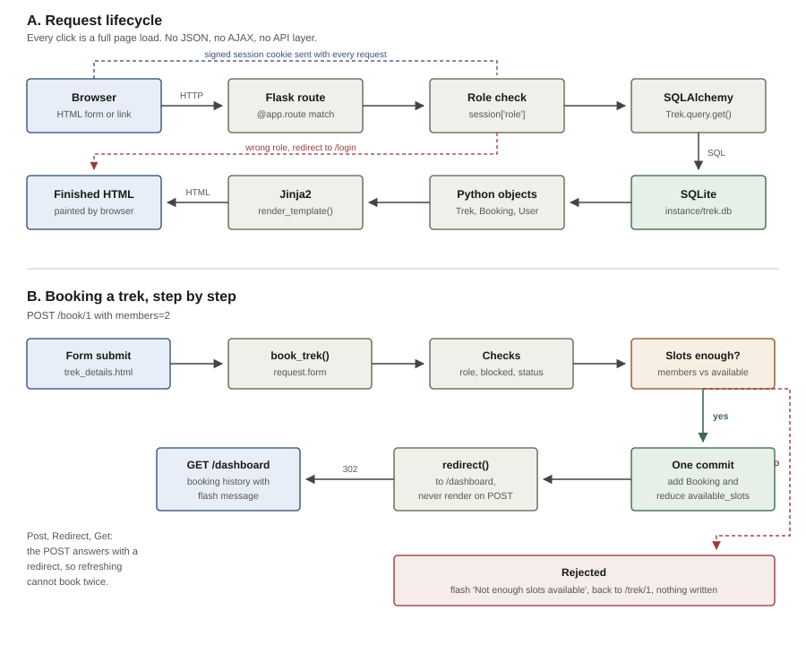
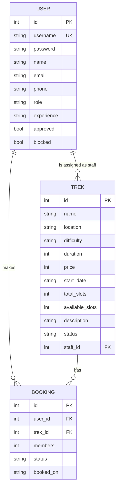

# Trekking Management Application

**Name:** Om Gupta
**Roll Number:** 24f3003029
**Email:** 24f3003029@ds.study.iitm.ac.in

## Problem Statement

The project is a web based trekking management system where three different kinds of people use the same site. An admin manages the treks and approves the trek staff, the trek staff manage the treks given to them, and normal users search for treks and book their slots. The main problem the application solves is keeping the slot count correct so that a trek never gets more bookings than the number of seats available, while still letting each role do only the work that belongs to that role.

## Approach

I started by deciding the three tables that the whole application needs, which are User, Trek and Booking. Instead of making separate tables for admin, staff and user I kept one User table with a `role` column, because all three log in the same way and only their permissions change. This kept the login code in one place.

After the tables I wrote the routes role by role. First the login and registration, then the admin side, then the staff side, and last the user booking side. Every protected route checks `session['role']` at the top and sends the person back to the login page if the role does not match. The slot logic is kept inside the booking route so that the available slots are reduced at the same time the booking row is created.

The database is created programmatically by `db.create_all()` and the admin account is inserted on the first run if it does not already exist, so no manual database work is needed.

## Frameworks and Libraries Used

- **Flask** for routing and the server
- **Flask-SQLAlchemy** for the models and database queries
- **Jinja2** for the HTML templates with template inheritance from `base.html`
- **Bootstrap 5** (CDN) for the layout, tables, cards and forms
- **Werkzeug security** for password hashing
- **SQLite** as the database

No JavaScript is used anywhere. All the searching, filtering and form handling is done on the server side.

## Data Flow

There is no API layer in this project. The frontend is HTML that Flask renders on the server and sends already finished, so every interaction is a full page load and no JSON or AJAX is involved.

A request arrives over HTTP, Flask matches it to a route, the route checks `session['role']` and redirects to the login page if the role is wrong, then queries SQLite through SQLAlchemy. The Python objects that come back are passed to `render_template()`, Jinja2 fills the placeholders, and the finished HTML goes back to the browser.

Data reaches the backend only through HTML forms. A POST form sends its fields in the body and the route reads them with `request.form`, while the search form uses GET so the values arrive in the URL and are read with `request.args`. Identity is kept in a session cookie signed with `SECRET_KEY`, which the browser returns on every request and which cannot be forged without the key.

Every route that changes data answers with `redirect()` instead of rendering, so refreshing the page after a booking cannot book the same trek twice. Messages survive that redirect through `flash()`.

## ER Diagram

### Relationships

| Relationship | Type | Description |
|---|---|---|
| User to Booking | One to Many | One user can book many treks, each booking belongs to one user |
| Trek to Booking | One to Many | One trek can have many bookings |
| User (staff) to Trek | One to Many | One staff can be assigned many treks, a trek has at most one staff |

The `role` column decides whether a User row is an admin, a staff or a trekker. `approved` is used only for staff and stays False until the admin approves the request. `blocked` is used by the admin to blacklist either a user or a staff.

## API Endpoints

### Authentication

| Endpoint | Method | Access | Description |
|---|---|---|---|
| `/` | GET | All | Home page listing treks, supports `?q=` and `?difficulty=` |
| `/login` | GET, POST | All | Login, redirects by role, blocks unapproved or blacklisted accounts |
| `/register` | GET, POST | Public | Trekker self registration |
| `/staff/register` | GET, POST | Public | Trek staff registration, waits for admin approval |
| `/logout` | GET | Logged in | Clears the session |
| `/trek/<tid>` | GET | All | Trek details page with the booking form |

### Admin

| Endpoint | Method | Description |
|---|---|---|
| `/admin` | GET | Dashboard with the summary counts and the full trek list |
| `/admin/trek/add` | GET, POST | Create a new trek |
| `/admin/trek/edit/<tid>` | GET, POST | Edit a trek, refuses if slots go below booked seats |
| `/admin/trek/delete/<tid>` | GET | Delete a trek along with its bookings |
| `/admin/trek/assign/<tid>` | GET, POST | Assign an approved staff to a trek |
| `/admin/staff` | GET | Pending requests and the approved staff list |
| `/admin/staff/approve/<uid>` | GET | Approve a staff request |
| `/admin/staff/reject/<uid>` | GET | Reject and remove a staff request |
| `/admin/users` | GET | List of all registered trekkers |
| `/admin/block/<uid>` | GET | Block or unblock a user or a staff |

### Trek Staff

| Endpoint | Method | Description |
|---|---|---|
| `/staff` | GET | Treks assigned to the logged in staff |
| `/staff/trek/<tid>` | GET, POST | Update slots and status, view the participant list |

### Trekker

| Endpoint | Method | Description |
|---|---|---|
| `/dashboard` | GET | Booking history of the logged in user |
| `/book/<tid>` | POST | Book slots on a trek |
| `/cancel/<bid>` | GET | Cancel a booking and return the slots |

## Features Implemented

**Overbooking prevention.** The booking route rejects the request if the members asked for are more than `available_slots`, and reduces `available_slots` in the same commit as the booking. A user cannot book the same trek twice while an active booking exists, and booking is closed unless the trek status is Upcoming.

**Slot editing is safe.** When the admin or the staff changes the total slots, the application first works out how many seats are already booked and refuses any value below that number. The available slots are then recalculated instead of being overwritten.

**Role based access control.** Every admin, staff and user route checks the role stored in the session. A staff member can open only the treks assigned to them, checked by comparing `trek.staff_id` with the logged in staff id.

**Staff approval workflow.** A staff account is created with `approved = False` and the login is refused with a message until the admin approves it. Only approved and unblocked staff appear in the assignment dropdown.

**Blacklisting.** The admin can block a user or a staff. A blocked account cannot log in and a blocked user cannot book.

**Booking history.** Cancelling does not delete the row, it only changes the status to Cancelled and adds the seats back, so the full history stays visible. When a staff marks a trek as Completed all its active bookings also become Completed.

**Search and filter.** The home page searches the trek name and location with a LIKE query and filters by difficulty, both done in Flask without any JavaScript.

## Database

The database file is created automatically at `instance/trek.db` on the first run. The default admin account is `admin` with password `admin123` and it is created only once.

## Video Link

<add the unlisted video link here before submitting>

## AI Declaration

<state here which parts were written with AI help, as required by the problem statement>
